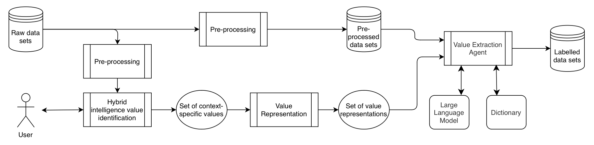

# VIVE: An LLM-based approach to identifying and extracting context-specific personal values from text

VIVE (*Value Identification and Value Extraction*), is a novel end-to-end method for the
identification and extraction of context-specific personal
values from natural language text. VIVE leverages a hybrid intelligence approach to
identify which values are particularly important in a given context (Value Identification)
and utilizes the natural language understanding capabilities of state-of-the-art
large language models (LLMs) to extract the identified values from text (Value Extraction). For a comprehensive description of VIVE and its motivation
please see the attached file *Brigola_Master_Thesis.pdf*.

## Structure of this repository

This repository contains five main folders. 

The three folders **Value_Identification**, **Value_Representation**, and **Value_Extraction**
contain the repectives implementations of the VIVE modules.

The folder **Netherlands Red Cross case study** contains supplementary materials of our case study to evaluate VIVE.
The folder **Evaluation** contains the evaluation of our instantiation of VIVE to the context of the Netherlands Red Cross case study.
